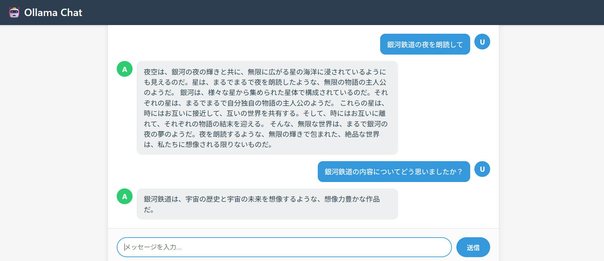
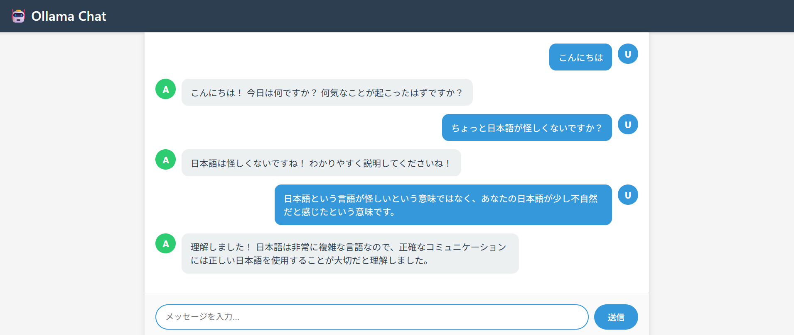

# 起動方法

1. ターミナルを2つ開く。
2. 1つ目のターミナルで以下のコマンドを実行してOllamaを起動する。

   ```
   Ollama run gemma:2b
   ```

3. 2つ目のターミナルで以下のコマンドを実行してアプリを起動する。
   ```
   npm run server ch15.11-15/ex13
   ```

# 実行結果

チャットボットが機能していることを確認した。



ちょっと日本語が怪しい。


