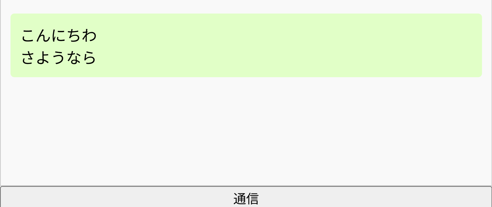
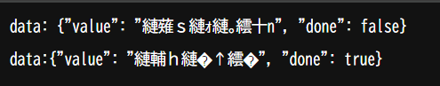

# 手順

1. 以下のコマンドを実行してサーバーを起動する。

   ```
   node ch15.11-15/ex14/server.js
   ```

2. 以下のURLにアクセスする。
   ```
   http://localhost:3000
   ```

# 実行結果

画面下部の「通信」ボタンを押下すると、2秒後に「こんにちは」が表示され、その3秒後に「さようなら」が表示された。



http://localhost:3000/message では、アクセスした瞬間に通信が開始され、2秒後に「こんにちは」のレスポンスデータが表示され、その3秒後に「さようなら」のレスポンスデータが表示された。


