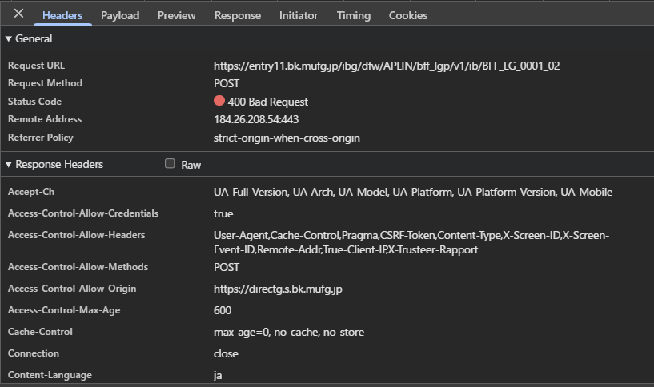

# 問題 15.11-15.17

実際のサービスの通信をデベロッパーツールなどで眺めて CORS の設定を確認しなさい。(金融系の認証ページなどで CORS の設定がされていることが多い)

---

## 解答

### 方法

三菱UFJ銀行の[ログインページ](https://directg.s.bk.mufg.jp/APL/LGP_P_01/PU/LG_0001/LG_0001_PC01)で適当な契約番号とパスワードを入力してログインを試みた。

### 確認されたCORSヘッダー



### ヘッダー内容

```
access-control-allow-credentials: true
```

- CookieやHTTP認証情報を含むリクエストを許可している。

---

```
access-control-allow-headers: ..., CSRF-Token, X-Screen-ID, X-Screen-Event-ID, Remote-Addr, True-Client-IP, X-Trusteer-Rapport
```

- **`CSRF-Token`**: CSRF攻撃対策
- **`X-Screen-ID`, `X-Screen-Event-ID`**: 画面遷移とイベントの追跡・監査用
- **`Remote-Addr`, `True-Client-IP`**: クライアントIPアドレスの追跡（不正アクセス検知）
- **`X-Trusteer-Rapport`**: IBM Trusteer（不正防止・マルウェア対策ソリューション）との連携　
  https://www.ibm.com/jp-ja/products/trusteer-rapport

---

```
access-control-allow-methods: POST
```

- ブラウザ履歴やログに機密情報が残らないように POST のみ許可している。

---

```
access-control-allow-origin: https://directg.s.bk.mufg.jp
```

- `*`を使わず、完全一致の単一オリジンのみ許可している。

---

```
cache-control: max-age=0, no-cache, no-store
```

- キャッシュを無効化している。

---

```
access-control-max-age: 600
```

- プリフライトリクエストの結果を10分間のみキャッシュしている。
