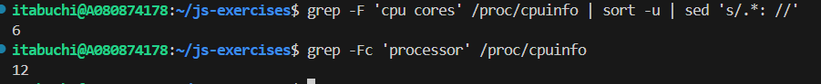

# 用語「マルチスレッド」について調べなさい。

## 解答

マルチスレッドとは、複数のスレッドを同時に実行することで処理を並列化する方式のことを指す。複数のスレッドは、同じプロセス内で独立して動作し、各スレッドは独自の実行コンテキストを持つ。これにより、CPUのリソースを効率的に活用し、アプリケーションのパフォーマンスを向上させることができる。JavaScriptにおいては、Web Worker などの技術を使用してマルチスレッド処理を実現することができる。

## 参考

- https://developer.mozilla.org/ja/docs/Glossary/Thread

# 次にフィボナッチ数を計算するmFib.jsをスレッド数を変更しながら実行し、 コンソール出力とOS機能で結果とスレッド数を確認しなさい。

項数を 45 に固定して、スレッド数を変化させて実行した結果は以下の通り。

```
スレッド数: 1、実行時間: 15.4秒
スレッド数: 2、実行時間: 11.5秒
スレッド数: 4、実行時間: 9.1秒
スレッド数: 6、実行時間: 8.3秒
スレッド数: 8、実行時間: 8.0秒
スレッド数: 10、実行時間: 8.3秒
スレッド数: 12、実行時間: 8.6秒
スレッド数: 16、実行時間: 8.8秒
スレッド数: 20、実行時間: 8.2秒
スレッド数: 24、実行時間: 8.4秒
スレッド数: 30、実行時間: 8.7秒
```

# 最後にあなたのPCのCPUスペックを調査し、適切なスレッド数についての考察を記しなさい。

以下のコマンドで物理コア数と論理コア数を確認した。

```js
grep -F 'cpu cores' /proc/cpuinfo | sort -u | sed 's/.*: //'
grep -Fc 'processor' /proc/cpuinfo
```

物理コア数は 6 、論理コア数は 12 であった。



実験結果を踏まえると、物理コア数(6)付近が最も効率的であり、それ以上スレッド数を増やしてもほとんど実行時間は変わらないと考えられる。同時に実行できるスレッド数はCPUのコア数に依存するため、物理コア数以上にスレッド数を増やしても、コンテキストスイッチングのオーバーヘッドが増加し、パフォーマンスが向上しないため。
