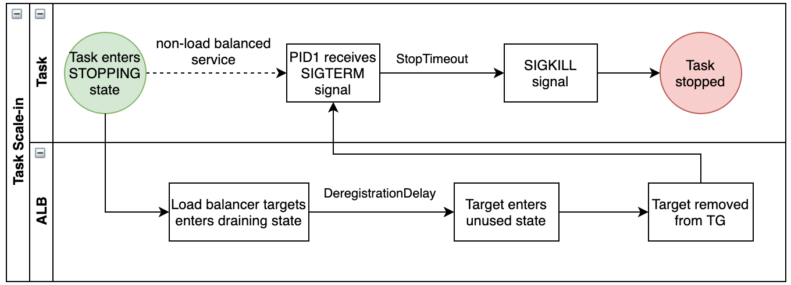

# また、主にクラウド上で動作するプログラムは、いわゆる Graceful Shutdown という動作が求められ、上記のような処理が必要な場合がある。Kubernetes や Amazon ECS などの Docker ランタイム上でコンテナの Graceful Shutdown のために送信されるシグナルの種類は何か書きなさい。

## KubernetesのGraceful Shutdown

1. `SIGTERM` (デフォルト)
   - Podが削除される際、まず `SIGTERM` シグナルが送信される
   - 猶予期間 (Grace Period)はデフォルトで30秒
2. `SIGKILL`
   - 猶予期間が過ぎてもプロセスが終了しない場合、強制終了
   - このシグナルはトラップできない

### 参考

- https://learnkube.com/graceful-shutdown

## Amazon ECS の Graceful Shutdown

1. `SIGTERM`
   - タスクが停止される際に送信される
   - ECS stop timeout（デフォルト30秒）内に終了する必要がある
2. `SIGKILL`
   - タイムアウト後に強制終了

### 参考

- https://aws.amazon.com/jp/blogs/containers/graceful-shutdowns-with-ecs/
