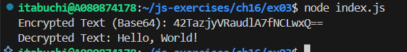
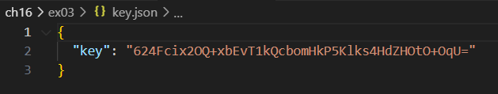
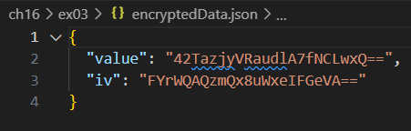

# 用語`AES`、`Base64`を調べて記しなさい。

## `AES（Advanced Encryption Standard）`

データを暗号化するための対称鍵暗号方式の一つ。ブロック暗号であり、128ビットのブロックサイズを持ち、鍵の長さは128、192、または256ビットのいずれかである。 AES は、TLS/SSL、Wi-Fiセキュリティなど多くのセキュリティプロトコルで採用されている。

## `Base64`

バイナリデータをASCII文字列にエンコードする方法の一つ。主に、電子メールや URL など、バイナリデータをテキスト形式で扱う必要がある場面で使用される。Base64 エンコードでは、3バイトのバイナリデータを4文字のASCII文字に変換する。

# 以下は、暗号化と`Base64`エンコード、`Base64`デコードと復号のサンプルコードです。穴埋めして完成させなさい。なお、穴埋め箇所では`crypto.Cipher`と`Buffer.from`を使用しなさい。なお、暗号化のアルゴリズムは`aes-256-cbc`を指定しなさい。

## 実行結果

key.json と　encryptedData.json が作成された。

