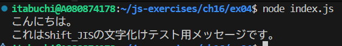

# Shift_JIS で保存されたテキストファイル hello.txt を読み込み、文字化けしないようにコンソールに表示しなさい。ライブラリiconv-liteを使用してよい。

## 入力

以下の内容がShift_JISで保存された`test.txt`を読み込む。

```
����ɂ��́B
�����Shift_JIS�̕��������e�X�g�p���b�Z�[�W�ł��B
```

## 出力結果

文字化けしていない文字列が表示されることを確認した。


