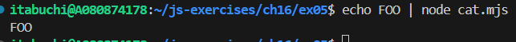
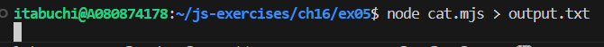
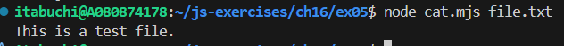
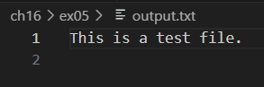
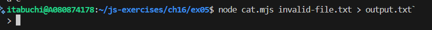
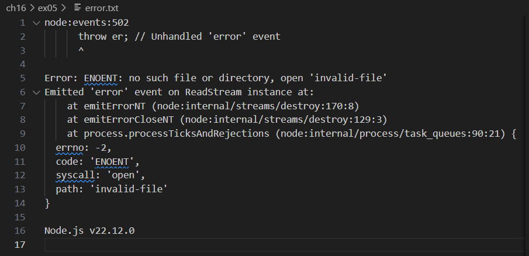

# 1. 標準入力、標準出力、標準エラー出力、リダイレクト、パイプという単語について調べなさい

## 標準入力

- プログラムがデータを受け取るためのデフォルトの入力元
- 通常はキーボードからの入力

## 標準出力

- プログラムがデータを出力するためのデフォルトの出力先
- 通常はコンソールへの出力（ファイルディスクリプタ1）

## 標準エラー出力

- プログラムがエラーメッセージを出力するためのデフォルトの出力先
- ファイルディスクリプタ2という、標準出力とは異なる出力として扱われる。

## リダイレクト

- 標準入力、標準出力、標準エラー出力のデフォルトの接続先を変更すること
- 例えば、ファイルから入力を受け取ったり、ファイルに出力を保存したりするなど

## パイプ

- 一つのプログラムの標準出力を別のプログラムの標準入力に接続すること
- 複数のプログラムを組み合わせてデータを処理する際に使用

# 2. 以下のコードを `cat.mjs` というファイルに保存し、後述する実験の結果を予測し、実際に実験しなさい

実験: `file` は適当なファイルとし `invalid-file` は存在しないファイルとしなさい

## `node cat.mjs`

### 予想

引数がないため、標準入力を標準出力にパイプする。
キーボードからの入力待ちになり、入力があればその文字列が出力される。

### 結果

標準入力待ちになり、何も出力されなかった。Ctrl+C または Ctrl+Dで終了するまで入力待ち状態が継続した。

## `echo FOO | node cat.mjs`

### 予想

`echo FOO` の出力（"FOO"）が標準入力にパイプされ、それが標準出力に出力される。
すなわち、コンソールに "FOO" が表示される。

### 結果

コンソールに "FOO" が表示された。

## `node cat.mjs > output.txt`

### 予想

標準出力が output.txt にリダイレクトされる。
引数が無いため、標準入力待ちになり、画面には何も表示されない。
入力があればoutput.txtに書き込まれるが、なければoutput.txtは空ファイルとして作成される。

### 結果

標準入力待ちになり、何も表示されなかった。
output.txtは空ファイルとして作成された。
Ctrl+C または Ctrl+Dで終了するまで入力待ち状態が継続した。

## `node cat.mjs file.txt`

### 予想

`file.txt` の内容が読み込まれ、標準出力に出力される。
コンソールにfile.txtの内容が表示される。

### 結果

コンソールにfile.txtの内容が表示された。

## `node cat.mjs file.txt > output.txt`

### 予想

`file.txt` の内容が読み込まれ、標準出力が output.txt にリダイレクトされる。
画面には何も表示されず、output.txt に file.txt の内容が書き込まれる。

### 結果

画面には何も表示されず、output.txtに以下の内容が書き込まれた。

## `node cat.mjs invalid-file > output.txt`

### 予想

存在しないファイルを読み込もうとするため、エラーが発生する。
`>` は「標準出力（ファイルディスクリプタ1）」を `output.txt` にリダイレクトする、という意味なので、画面には何も表示されず、output.txt には何も書き込まれない。

### 結果

コンソールには何も表示されず、output.txt には何も書き込まれなかった。

## `node cat.mjs invalid-file 2> error.txt`

### 予想

存在しないファイルを読み込もうとするため、エラーが発生する。
`2>` は「標準エラー出力（ファイルディスクリプタ2）」を `error.txt` にリダイレクトする、という意味なので、画面には何も表示されず、error.txtにエラーメッセージが書き込まれる。

### 結果

画面には何も表示されず、error.txtにエラーメッセージが書き込まれた。

