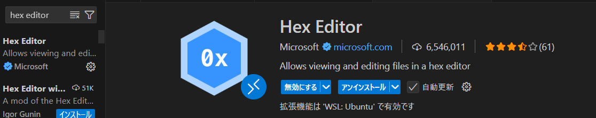
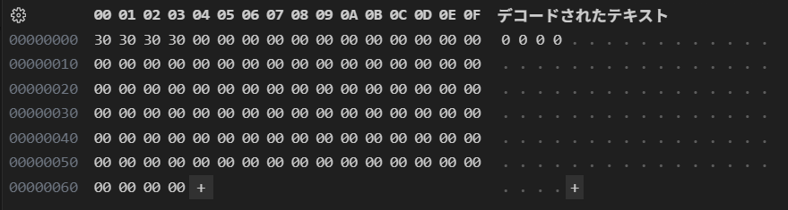

# P.664では`fs.truncate()`を利用してファイルを拡張した場合には拡張された部分には0が書き込まれる、と説明されていますが、これはASCIIの"0"が書き込まれるという意味ではありません。実際に`fs.truncate()`を利用してファイルを拡張し、拡張されたファイルの内容をバイナリエディタで確認しなさい。

## 確認方法

`fs.truncate()`を利用してファイルを拡張し、拡張されたファイルの内容を VS Code の HexEditor 拡張機能を使用して確認した。

## 結果

`fs.truncate()`で拡張された部分には `0x30`（ASCII '0'）ではなく、`0x00`（ヌルバイト）が書き込まれていた。

