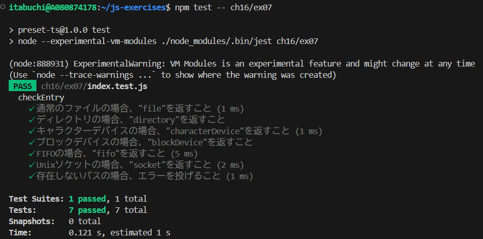

# 指定のパス文字列を引数にとり、ファイルなら`file`、ディレクトリなら`directory`を返す`checkEntry`関数を`fs.stats`を利用して実装しなさい。なお、可能なら`file`, `directory`以外を返すパターンの必要性を考えてそれも関数内に実装しなさい。

## 実装内容

### file

ファイル

### directory

ディレクトリ

### blockDevice

ブロックデバイスとは、データをブロック単位で読み書きする入出力デバイスのこと。主にハードディスクやSSDなどのストレージデバイスが該当する。

### characterDevice

キャラクターデバイスとは、データを1バイトずつ読み書きする入出力デバイスのこと。主にキーボードやマウスなどの入力デバイスが該当する。

### fifo

FIFO（First In First Out）とは、データが最初に入った順番で出力される入出力方式のこと。主にパイプなどの通信手段が該当する。

### socket

ソケットとは、ネットワーク通信を行うためのエンドポイントのこと。主にTCP/IP通信などで使用される。

### 補足

`fs.stats` では、シンボリックリンク自体の情報を取得することができないため、シンボリックリンクを判別することはできない。シンボリックリンクを判別するには、`fs.lstat` を使用する必要がある。

## テスト結果

全てのテストに成功することを確認した。

