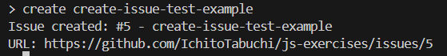
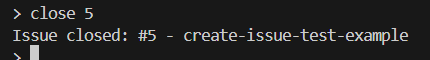
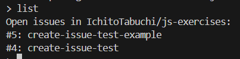
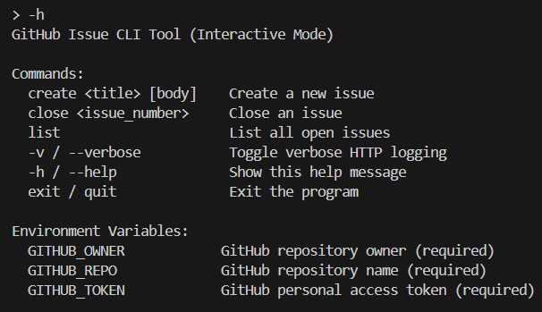
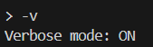

# GitHub の REST API を利用して Issue を操作するコマンドラインツールを実装しなさい。最低限以下の要件を満たすこと。

- 入力はコマンドライン引数から受け取る
- Issue を作成できる
- 指定した Issue をクローズできる
- オープンな Issue の Id と Title の一覧を表示できる
- `-h`または`--help`オプションで使い方が確認できる
- `-v`または`--verbose`オプションで HTTP ログを出力する

## 環境変数

ex08 ディレクトリに `.env` ファイルを作成し、以下の環境変数を設定すること。

```bash
GITHUB_OWNER=your-github-username
GITHUB_REPO=your-repository-name
GITHUB_TOKEN=your-personal-access-token
```

## コマンド

### コマンドラインツールの起動

```bash
node index.js
```

### Issue の作成

```bash
create "Issue title" "Issue body"
```



#### Issueのクローズ

```bash
close "Issue の ID"
```



#### オープンな Issue の Id と Title の一覧の表示

```bash
list
```



### ヘルプの表示

```bash
-h
--help
```



### Verboseモード (HTTPリクエスト/レスポンスのログを表示)

```bash
-v
--verbose
```



### コマンドラインツールの終了

```bash
exit
quit
```
