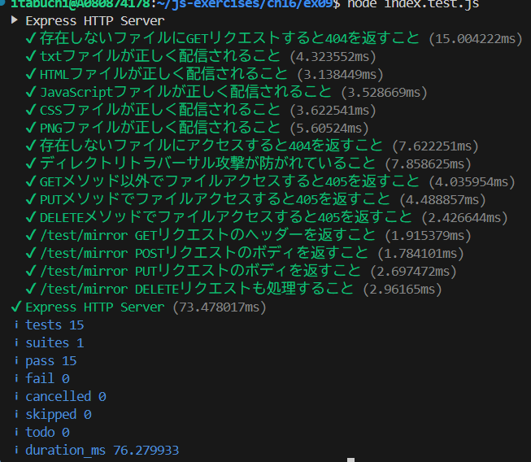

# Express フレームワークを利用して P.672 のサンプルコードと同等の HTTP サーバーを実装しなさい。テストはSupertestを利用しなさい。

## http.Server と Express の違い

- Express フレームワークを使用することで、ルーティングが if-else 文による手動分岐から、`app.use` などによる宣言的なルーティングへと改善され、コードの可読性と保守性が向上している。

## テスト実行結果

全てのテストが成功することを確認した。

