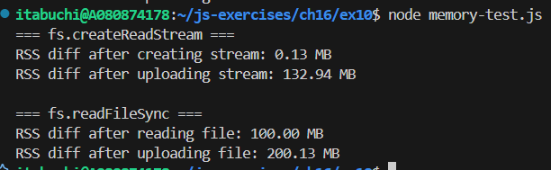

# また大きな file.txt に対し fs.createReadStream を利用した場合と fs.read を利用した場合でメモリ使用量がどれだけ違うか確認しなさい。

## 結果

- fs.createReadStream で Stream を生成した直後のメモリ使用量増加は約 0.13MB であり、アップロードによる増加は約 132 MB となった。
- fs.read をファイルを読み込んだ直後のメモリ使用量増加は約 100MB であり、アップロードによる増加は約 200 MB となった。

  

## 考察

- fs.createReadStream を利用した場合、ファイル全体を一度にメモリに読み込むのではなく、必要な部分だけを逐次的に読み込むため、メモリ使用量が抑えられる。
- 一方、fs.read を利用した場合、ファイル全体を一度にメモリに読み込むため、大量のメモリを消費する。
- そのため、大きなファイルを扱う場合は fs.createReadStream を利用することで、メモリ効率の良い処理が可能となる。
