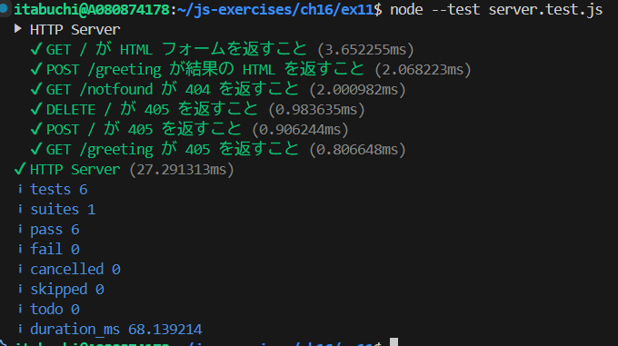
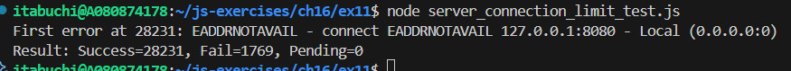
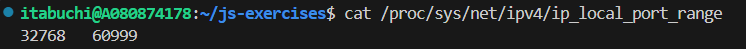
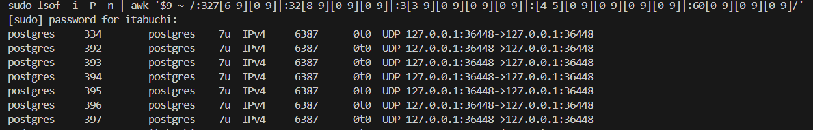

# ブラウザと以下の通信ができる HTTP サーバを net パッケージのみを用いて実装しなさい。

## 対応しているエンドポイント

1. **GET /** - HTMLフォームを返却
2. **POST /greeting** - フォームデータを処理してHTMLを返却
3. **その他** - 404または405を返却

## テストコード実行結果



# また、複数のTCPクライアント (net.Socket) でHTTPリクエストを送信せず同時に接続を維持した際、何接続で接続が確立できなくなるか確認し、確立できなかった理由を書きなさい。

サーバーを起動した状態で、同時接続テスト`test_connection_limit_test.js`を実行し、接続数の上限を確認した。

```bash
node server_connection_limit_test.js
```

### 実測結果

28,231件の接続で接続が確立できなくなった。



### 接続が確立できなくなった理由

エフェメラルポート（一時ポート）が枯渇したため。

クライアントが同じIPアドレスからサーバーに接続する場合、各接続には異なるポート番号が必要である。
利用可能なポート範囲は以下のコマンドで確認できる。

```bash
$ cat /proc/sys/net/ipv4/ip_local_port_range
```

上記コマンドを実行した結果は以下の通り。



コマンド実行結果より、60999 - 32768 + 1 = 28,232 件のポート番号が利用可能であることが分かる。実測結果では、28,231接続でポート番号が枯渇し、それ以上は `EADDRNOTAVAIL`（アドレスが利用不可）エラーが発生していることから、クライアント側のエフェメラルポートの物理的上限に達したことを示している。

### 補足: サーバーポート8080との関係

サーバーの待ち受けポート8080は、エフェメラルポート範囲（32768〜60999）外であるため、28,232個のカウントには含まれない。調査の結果、28,231接続で止まったのは、PostgreSQLがエフェメラルポート範囲内でUDP接続を使用していたため。


