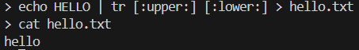
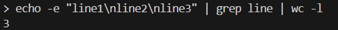
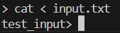

# シェルの動作確認

## 問題文の「パイプやリダイレクトの例」のテスト

大文字の`HELLO`を小文字に変換して`hello.txt`に保存するコマンド

```bash
> echo HELLO | tr [:upper:] [:lower:] > hello.txt
```

### 実行結果

hello.txtが作成され、小文字の`hello`が書き込まれている。



## 複数パイプのテスト

行数を数えるコマンド

```bash
> echo -e "line1\nline2\nline3" | grep line | wc -l
```

### 実行結果

`-e`オプションでエスケープシーケンスを有効化して3行を出力し、その中から`line`を含む行を`grep`で抽出し、`wc -l`で行数を数えているため、結果は3となる。



## 入力リダイレクトのテスト

```bash
> cat < input.txt
```

### 実行結果

input.txtの内容が表示されている。



# `cmd /c dir | cmd /c "findstr DIR"`について

## なぜ直接`dir`を使わないのか？

- `dir`はコマンドではなく、`cmd.exe`のビルトインコマンドであるため`spawn("dir", ...)`は失敗するので、`cmd /c`を使うことで、cmd.exeを起動してその中で`dir`コマンドを実行している。

## `cmd /c`の意味

- `cmd`: Windowsのコマンドプロンプトを起動
- `/c`: コマンドを実行した後、cmd.exeを終了する
- 例: `cmd /c dir` は「cmd.exeを起動して`dir`を実行し、終了する」
