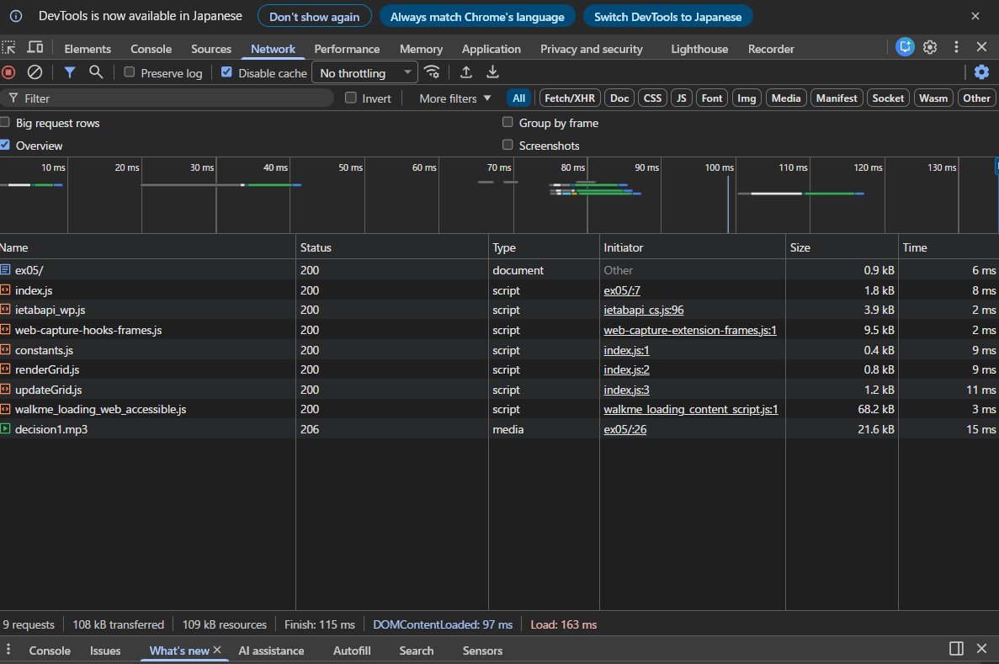
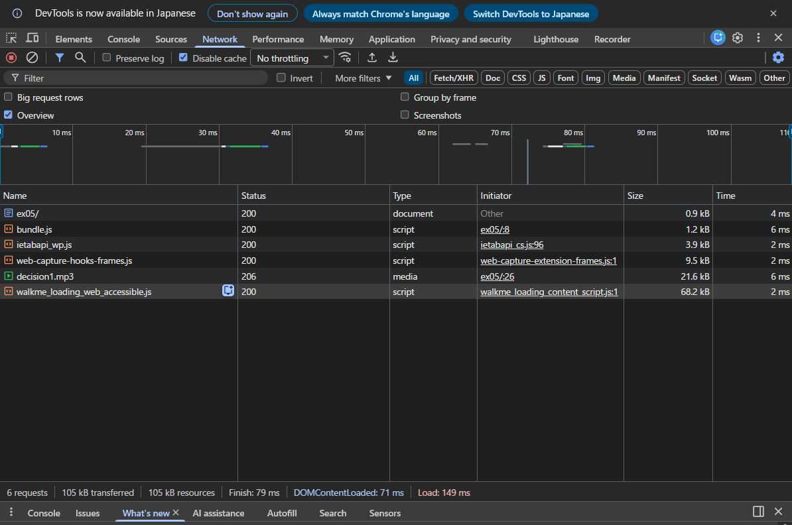

# バンドルしたコードと元のコードを比較し、どのような処理が行われたかを確認しなさい。

# バンドル前後それぞれのコードを利用するページをローカルサーバで配信してブラウザから閲覧できるようにしなさい。開発者ツールで `ネットワーク` タブを開き、スクリプトのダウンロード時間、ページの読み込み完了時間について比較しなさい。

- スクリプトのダウンロード時間については、バンドル後のコードの方が短くなった。これは、バンドルされたコードがミニファイされており、ファイルサイズが小さくなっているためである。
- ページの読み込み完了時間についても、バンドル後のコードの方が短くなった。これは、バンドルされたコードが最適化されており、ブラウザがコードを解析して実行する時間が短縮されているためである。

### バンドル前

### バンドル後

