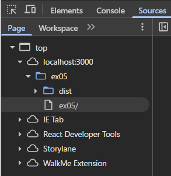
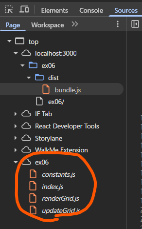
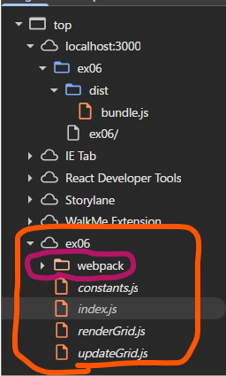
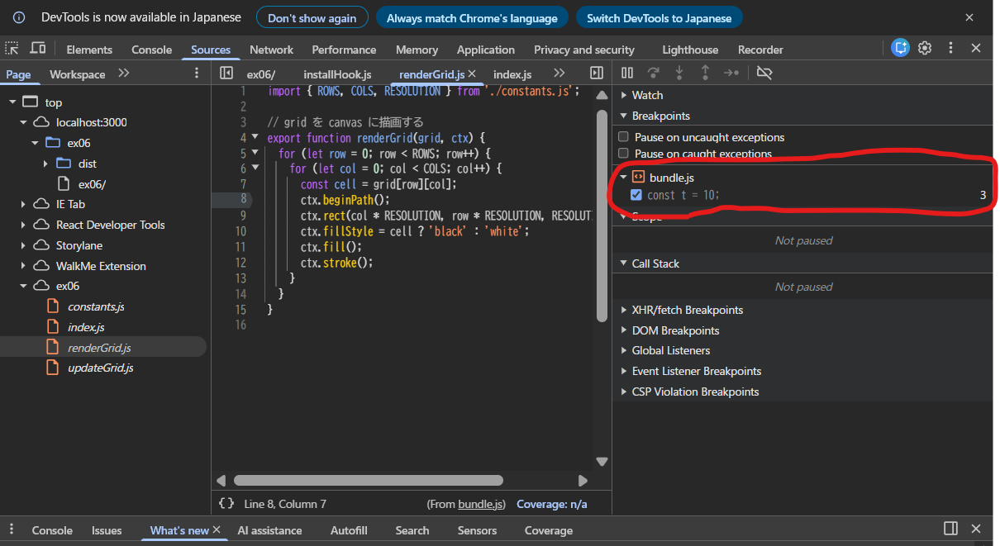
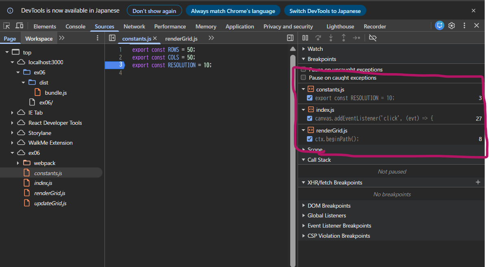

# [問題 17.5](#問題-175-) について、webpack の設定でバンドル時にソースマップを生成するようにしなさい。

## ソースマップの生成

- `webpack.config.js`に、`devtool: 'source-map'`オプションを追加してソースマップを生成するよう設定した。
- また、開発者ツールで元のソースコードに基づくデバッグを行うために、`mode: 'development'`を指定した。（`production` モードとの違いについては後述する。）

```javascript
export default {
  mode: 'development', // 開発者ツールでソースマップを使用したデバッグができるようにするために必要な設定。production モードだと元のソースコードにブレークポイントが貼れない。
  entry: './index.js',
  output: {
    filename: 'bundle.js',
    path: path.resolve(__dirname, 'dist'),
  },
  devtool: 'source-map', // ソースマップを生成
};
```

# 開発者ツールで `ソース` タブ(Chrome, Edge, Safari) または `デバッガー` タブ(Firefox) を開き、ソースコードファイルがどのように表示されるかを確認しなさい。

### ex05 (ソースマップなし)



### ex06 (ソースマップあり、production モード)

元のソースコードは表示されるが、webpack のランタイムは表示されない。



## ex06 (ソースマップあり、development モード)

元のソースコードと webpack のランタイムが表示される。



# バンドルしたコードの実行中に、バンドル前のソースコードファイルに基づいたブレークポイントの設定や変数の値の確認等のデバッグが可能か確認しなさい。

### ex06 (ソースマップあり、production モード)

元のソースコードにブレークポイントを貼ろうとすると、全て bundle.js のコードの3行目に対するブレークポイントに変換されてしまう。



## ex06 (ソースマップあり、development モード)

元のソースコードに基づいたブレークポイントを実行できる。


